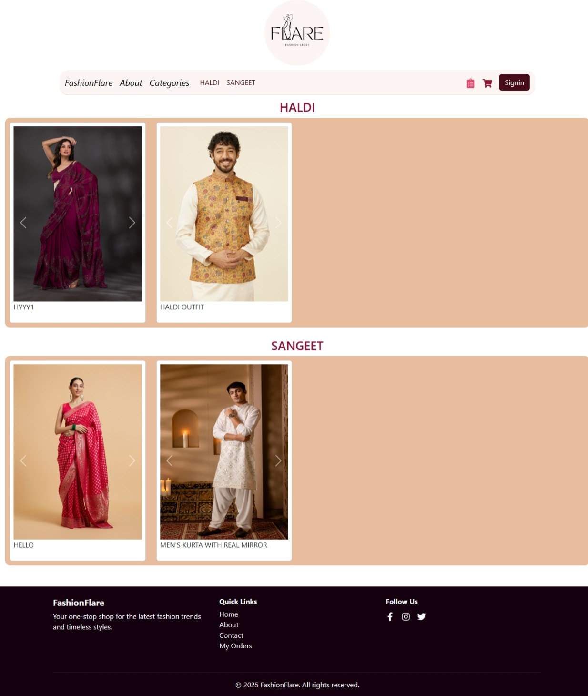
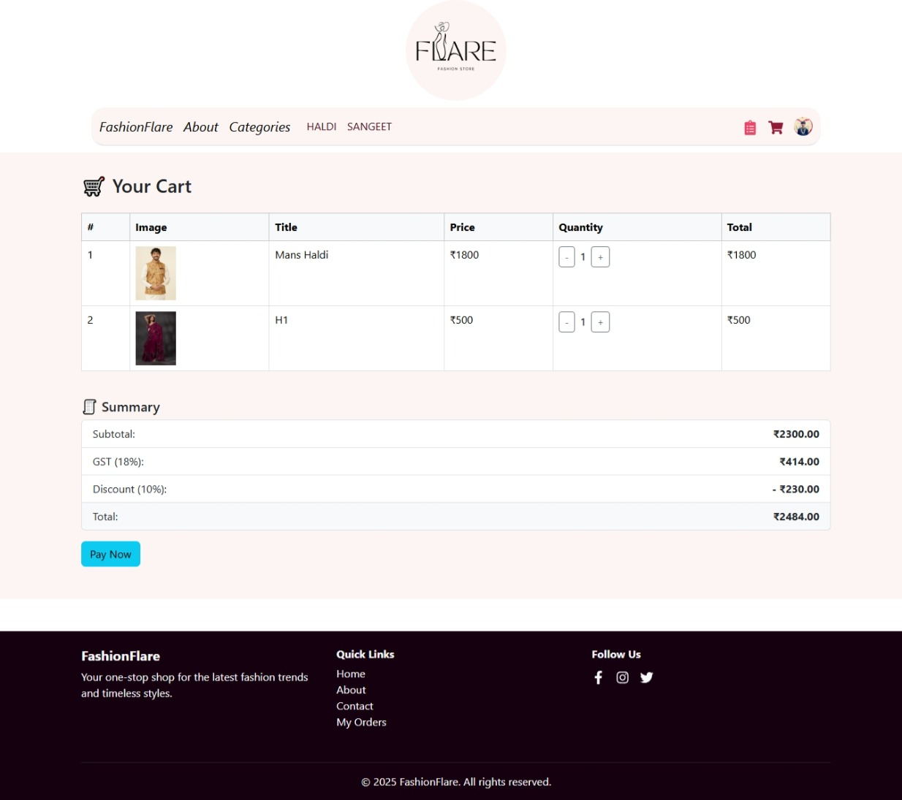
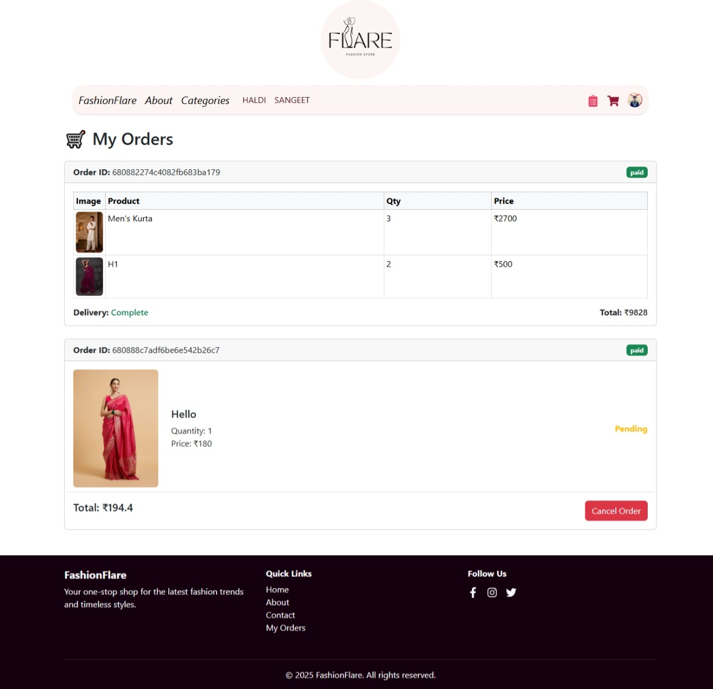
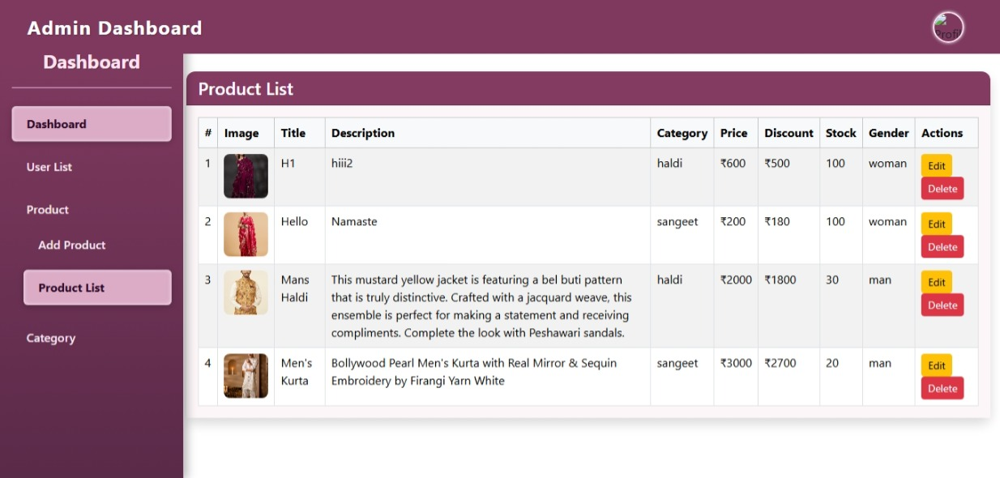

# Fashion Flare - MERN Stack E-commerce Platform

Fashion Flare is a modern e-commerce platform built with the MERN stack (MongoDB, Express.js, React, Node.js) specifically designed for fashion products. This platform provides a seamless shopping experience with features like product browsing, cart management, secure payments, and user authentication.

## Features

🛍️ Product Catalog – Browse products with category-wise organization

🔎 Category Filtering – View products based on selected category

🛒 Shopping Cart – Add products to the cart and manage items

💳 Stripe Test Payment – Secure checkout using Stripe (test mode)

👤 Authentication with Clerk – User sign-in and sign-up handled via Clerk

🔐 Admin Dashboard – Admin can manage products and categories

⚡ Vite-Powered Frontend – Fast and optimized React experience

## Tech Stack

### Frontend
- React 19
- React Router DOM
- React Bootstrap
- Axios
- React Toastify
- Vite

### Backend
- Node.js
- Express.js
- MongoDB
- Mongoose
- Stripe
- CORS

## Prerequisites

- Node.js (v18 or higher)
- MongoDB
- PNPM (Package Manager)
- Git

## Installation

### Backend Setup

1. Navigate to the server directory:
```bash
cd server
```

2. Install dependencies:
```bash
pnpm install
```

3. Create a `.env` file in the server directory with the following variables:
```
DB_URL=your_mongodb_connection_string
PORT=5000
STRIPE_SECRET_KEY=your_stripe_secret_key
```

4. Start the development server:
```bash
pnpm run dev
```

### Frontend Setup

1. Navigate to the client directory:
```bash
cd client
```

2. Install dependencies:
```bash
pnpm install
```

3. Create a `.env` file in the client directory with the following variables:
```
BACKEND_URL=http://localhost:5000
CLERK_PK=your_clerk_public_key
```

4. Start the development server:
```bash
pnpm run dev
```

## Project Structure

```
fashion-flare/
├── client/                 # Frontend React application
│   ├── src/               # Source files
│   ├── public/            # Static files
│   └── package.json       # Frontend dependencies
├── server/                # Backend Node.js application
│   ├── controllers/       # Route controllers
│   ├── models/            # MongoDB models
│   ├── routes/            # API routes
│   └── package.json       # Backend dependencies
└── README.md              # Project documentation
```

## Contributing

1. Fork the repository
2. Create your feature branch (`git checkout -b feature/AmazingFeature`)
3. Commit your changes (`git commit -m 'Add some AmazingFeature'`)
4. Push to the branch (`git push origin feature/AmazingFeature`)
5. Open a Pull Request


## 📷 Screenshots

### 🏠 Home Page


### 🧥 About Section


### 🧥 Categories Section


### 👕 Cart Details


### 👕 Orders Details


### 🧑‍💻 Admin Dashboard


## License

This project is licensed under the ISC License.

## Support

For support, please open an issue in the GitHub repository or contact the maintainers.
